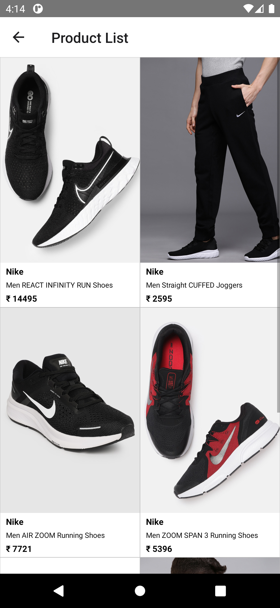
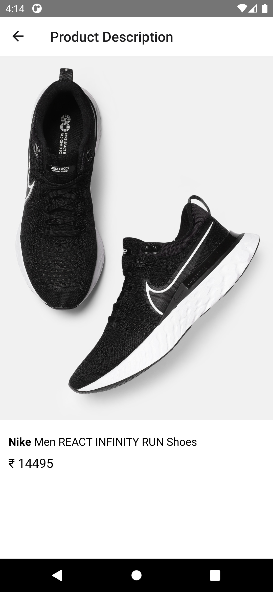

# React Native Bootcamp 2021 App

Welcome new joiners! This is a basic React Native application with navigation and redux support.

## Setup

### Prerequisites

You need to setup react native dev environment in your system.

```
brew install node
brew install watchman
brew install --cask adoptopenjdk/openjdk/adoptopenjdk8
```

You also need to download and setup Android Studio and XCode.

[More details here](https://reactnative.dev/docs/environment-setup)

### Building the App

We can build the react-native application either using `react cli` or by manually running platform specific scripts.

#### Using react cli

```
react-native run-android // run android app
react-native run-ios // run iOS app
```

#### Manually

Inorder to build the app manually, first you need to run the node server which will serve our app bundle.

```
npm start
```

Now, for android specific app build, you need to run this command in `android` directory of the project.

```
./gradlew installDebug
```

This command will build the APK and installed it in the connected device.
Make sure your emulator is running before running this command.

For building the iOS app, we would require XCode. You need to open the `ios` directory as a project in XCode and hit run.

## App Screenshots




